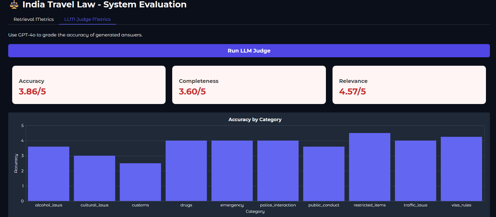

# 🇮🇳 Travel Law Assistant (AI-Powered)


**A specialized RAG (Retrieval-Augmented Generation) application that helps tourists and foreign visitors navigate Indian laws regarding safety, visas, drugs, and police interaction.**

> *"This isn't just a chatbot; it's a legal reference system grounded in the actual Indian Penal Code, CrPC, and local Acts, stripped of jargon and optimized for travelers."*

---

## 🚀 Key Features

* **🛡️ Domain-Specific Legal Knowledge:** Built on a curated dataset of Indian laws relevant to daily life (not abstract constitutional theory).
* **🧠 Context-Aware Chat:** Remembers conversation history to handle follow-up questions naturally (e.g., *"What is the fine?"* -> *"What if I repeat the offense?"*).
* **⚡ Advanced RAG Pipeline:**
    * **Query Rewriting:** Transforms vague user queries into precise legal search terms.
    * **Semantic Reranking:** Uses **Cross-Encoders** to re-score the top 50 retrieval results, ensuring the most legally specific clause hits the top 5.
* **📊 Built-in Evaluation Dashboard:** Includes a dedicated UI to measure Retrieval (MRR/nDCG) and Generation (Accuracy/Relevance) performance.

---

## 📊 Performance & Evaluation

Unlike standard "Chat with PDF" wrappers, this system includes a rigorous evaluation pipeline (`eval_ui.py`) to prove its reliability.

### 1. LLM Judge Metrics (Accuracy: ~3.8/5)
Using GPT-4o as a legal judge, the system consistently provides accurate, relevant, and safe legal advice.


### 2. Retrieval Metrics
Optimized using Semantic Reranking to solve the "vocabulary gap" between tourist questions and legal texts.


---

## 🧠 The Data Engineering (The Foundation)

Building a reliable legal AI requires more than just dumping PDFs into a database. This project involved a rigorous **ETL (Extract, Transform, Load)** process:

1.  **Scope Identification:** Identified exact legal intersections for travelers (Traffic, Police, Drugs, Visas).
2.  **Authoritative Sourcing:** Collected raw legal texts (IPC, CrPC, NDPS, MV Act, COTPA).
3.  **Noise Filtering:** Removed procedural/irrelevant sections (e.g., court administrative rules).
4.  **Markdown Conversion:** Converted complex PDFs into clean, structured Markdown to preserve Section Numbers.
5.  **Chunking Strategy:** Implemented smart text chunking to keep "Crime + Penalty" logic intact within single vectors.

### 📚 Legal Modules Covered
| Module | Acts/Laws Covered | Focus Area |
| :--- | :--- | :--- |
| **Visa & Entry** | *Foreigners Act, 1946* | Overstaying, FRRO, Work restrictions |
| **Police Interaction** | *CrPC (Code of Criminal Procedure)* | Arrest rights, Bail, Warrants, Women's safety |
| **Drugs & Narcotics** | *NDPS Act* | Possession limits, strict penalties (No "personal use" excuse) |
| **General Conduct** | *COTPA, IPC Sec 294* | Smoking in public, PDA, Public nuisance |
| **Traffic & Safety** | *Motor Vehicles Act* | Drunk driving (BAC limits), Accidents, Good Samaritan Law |
| **Emergency** | *Public Safety Guidelines* | 112 Helpline, Lost Passport protocols |

---

## 🛠️ Tech Stack

* **LLM Engine:** OpenAI GPT-4o
* **Vector Database:** ChromaDB (Persistent storage)
* **Embeddings:** `text-embedding-3-small`
* **Reranking:** `cross-encoder/ms-marco-MiniLM-L-6-v2`
* **Interface:** Gradio (Web UI)
* **Evaluation:** RAGAS-inspired custom metrics (MRR, nDCG, LLM Judge)

---

## ⚙️ Installation & Setup

### 1. Clone the Repository
```bash
git clone [https://github.com/your-username/india-travel-law-assistant.git](https://github.com/your-username/india-travel-law-assistant.git)
cd india-travel-law-assistant
```

###2. Set up Virtual Environment

# Windows
python -m venv venv
.\venv\Scripts\Activate

# Mac/Linux
python3 -m venv venv
source venv/bin/activate

###3. Install Dependencies

pip install -r requirements.txt

###4. Configure Secrets
Create a .env file in the root directory and add your OpenAI Key:

OPENAI_API_KEY=sk-your-api-key-here


###🏃‍♂️ Usage
Step 1: Ingest the Legal Data
Before running the app, you must vectorize the markdown files. This converts the clean legal text into mathematical embeddings.

python scripts/ingest.py

Output: ✅ Success! Database created with XX legal chunks.

Step 2: Run the Assistant

python app.py

Open your browser to the local URL (usually http://127.0.0.1:7860).

###📂 Project Structure

travel-law-assistant/
├── data/
│   └── markdown/
│       └── filtered/       # The gold-standard clean legal datasets
├── scripts/
│   ├── ingest.py           # ETL pipeline: Markdown -> Vector DB
│   └── answer.py           # RAG Logic: Retrieval + Generation
├── preprocessed_db/        # ChromaDB persistence (Generated locally)
├── app.py                  # Gradio Frontend
├── requirements.txt        # Dependencies
└── README.md

###⚠️ Disclaimer
This project is for educational and informational purposes only. While the data is sourced from official Indian laws, the AI's output does not constitute legal advice. Users should always verify information with a qualified advocate or local authorities (Police/FRRO) for serious legal matters.

###👨‍💻 Author
Built a Project focusing on AI Safety & Legal Tech.
